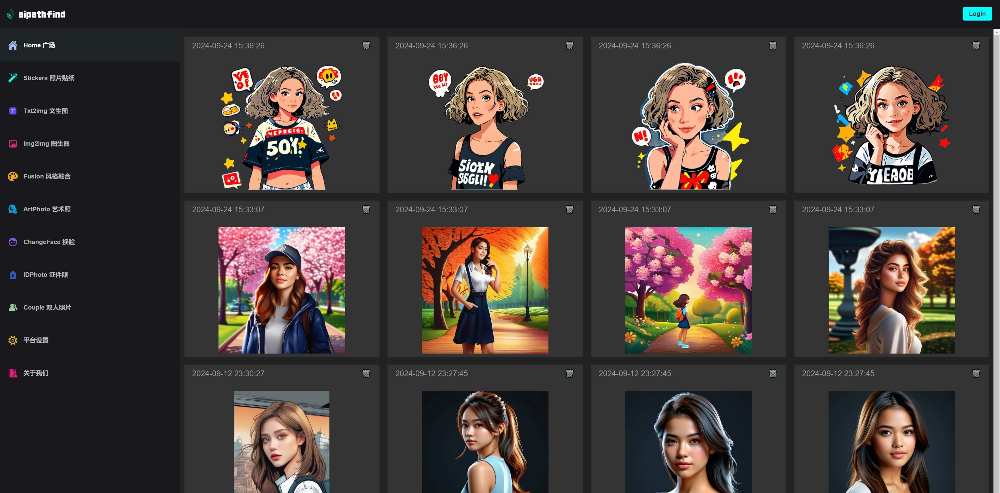
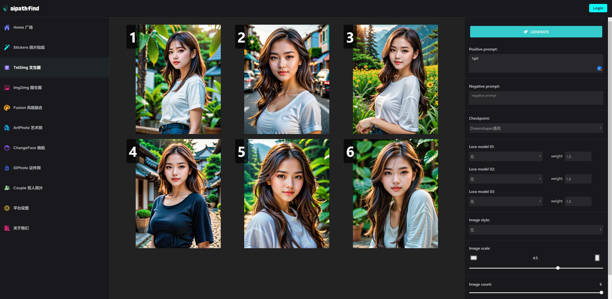
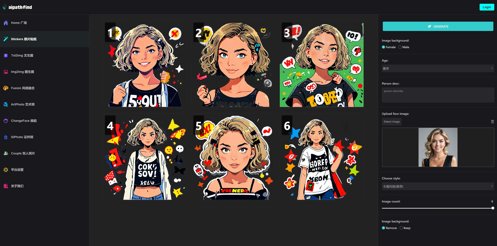
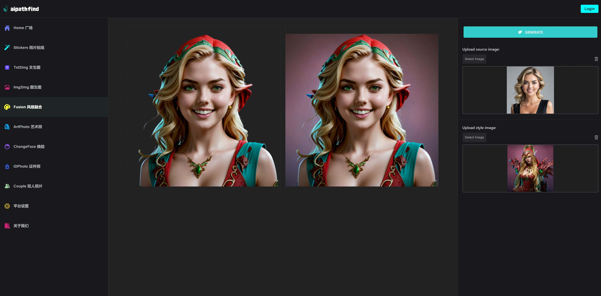
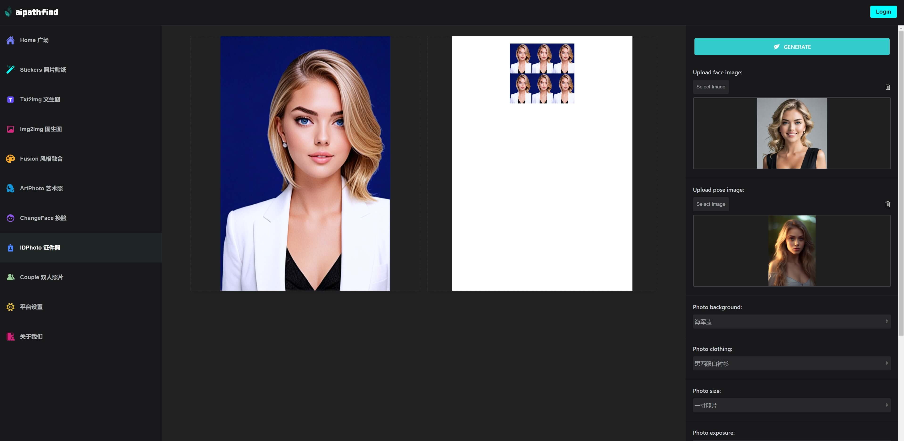

# comfyui-flask-webui
Un sitio web para generar imágenes con IA utilizando Flask, basado en ComfyUI.

## Debido a la rápida evolución de ComfyUI, muchos flujos de trabajo han dejado de ser válidos. Este proyecto no puede ejecutarse correctamente y ya no se mantiene.

<p align="center">
    
</p>

## Introducción
Un sitio web de generación de imágenes sin conexión, que convierte los flujos de trabajo de ComfyUI en funcionalidades web, facilitando su uso.

**Características del sitio web:**

1. **Stickers** Generar stickers a partir de una fotografía
2. **Txt2img**
3. **Img2img**
4. **Fusion** Fusión de estilos de dos fotografías
5. **ChangeFace**
6. **IDPhoto** Generar fotografías de identidad de una o dos pulgadas a partir de una sola imagen

**Capturas de pantalla del sitio web:**

1. Captura de la página de Txt2img
<p align="center">
    
</p>

2. Captura de la página de Stickers
<p align="center">
    
</p>

3. Captura de la página de Fusion
<p align="center">
    
</p>

4. Captura de la página de Idphoto
<p align="center">
    
</p>

## Configuración de ComfyUI

Para iniciar tu ComfyUI, asegúrate de que el flujo de trabajo de ComfyUI funcione correctamente, puerto predeterminado 8188.  
Puedes encontrar más información en el siguiente enlace:  
https://github.com/comfyanonymous/ComfyUI  
Los checkpoints y loras que ComfyUI necesita para funcionar aún se están organizando y se proporcionarán conjuntamente en el futuro.

## Cómo instalar

1. **Crear entorno virtual**
```bash
conda create -n comfyui-flask-webui python=3.10
conda activate comfyui-flask-webui
cd comfyui-flask-webui
pip install -r requirements.txt
```

2. **Inicializar SQL**
```bash
flask db init
flask db migrate
flask db upgrade
```

3. **Crear usuario**  

Renombra config_template.py a config.py  
Si necesitas que los prompts admitan chino, debes ingresar tu propio appid y key de Baidu Translate:  
https://api.fanyi.baidu.com/

```bash
python test/create_user.py
```

4. **Ejecutar el proyecto**
```bash
python manage.py
```

## Contacto

alienfist@gmail.com
