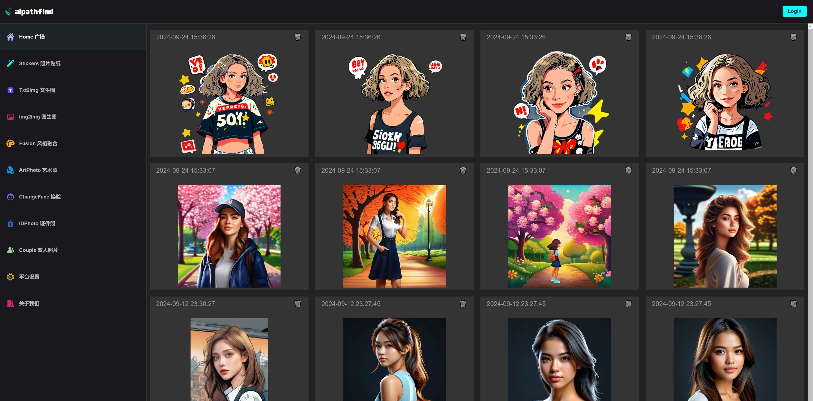
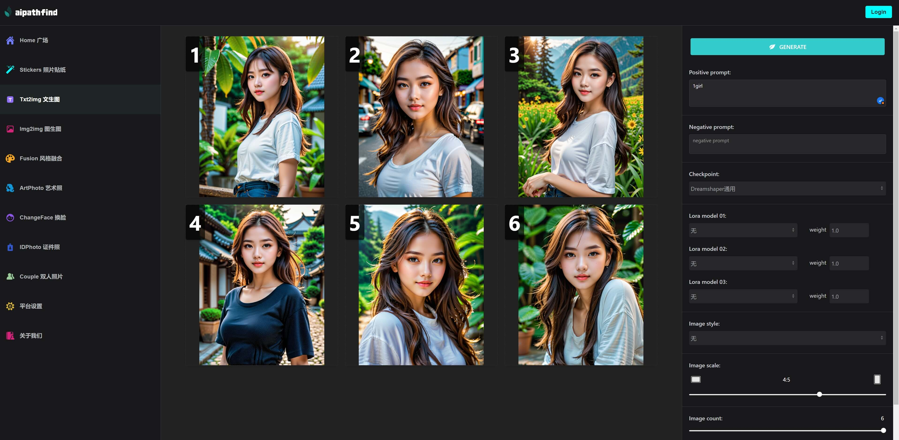
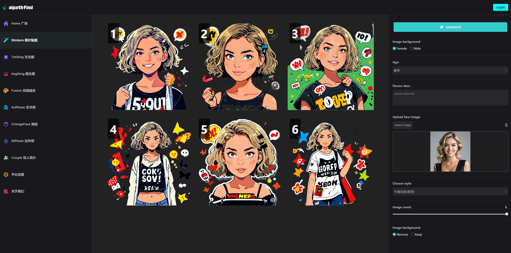
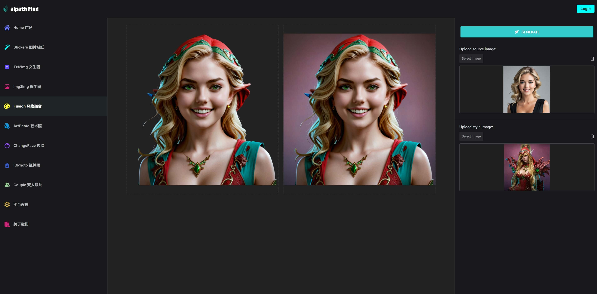
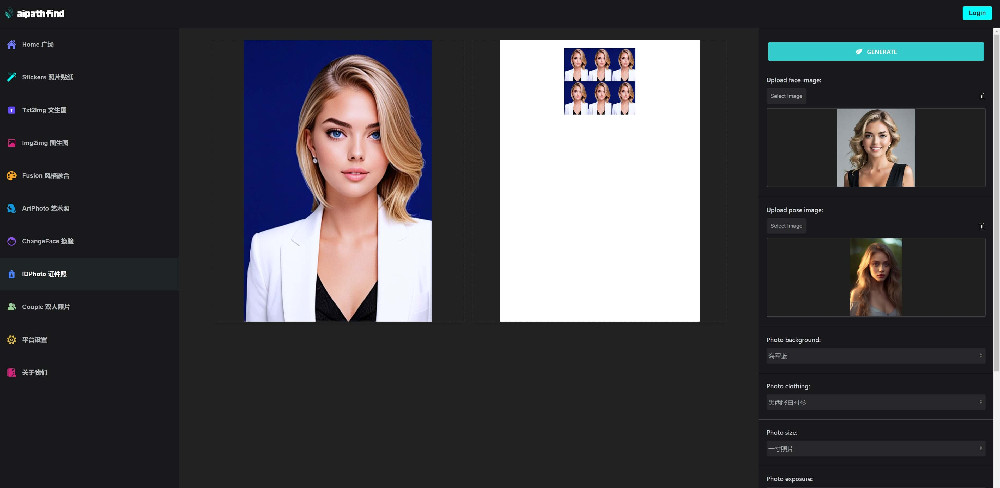

以下是您提供的 Markdown 文本的中文翻译：

---

# comfyui-flask-webui
基于ComfyUI和Flask的AI图像生成网站

<p align="center">
    
</p>

## 介绍
离线AI图像生成网站，ComfyUI工作流转换为网站功能，使其更易于使用。

**网站功能：**

1. **生成贴纸** 从照片生成贴纸
2. **文本转图像** (Txt2img)
3. **图像转图像** (Img2img)
4. **图像融合** 两种照片风格的融合
5. **照片换脸** (ChangeFace)
6. **证件照生成** 从一张照片生成一寸或二寸身份证照片

**网站截图：**

1. 文本转图像页面截图
<p align="center">
    
</p>

2. 贴纸页面截图
<p align="center">
    
</p>

3. 融合页面截图
<p align="center">
    
</p>

4. 身份证照片页面截图
<p align="center">
    
</p>

## ComfyUI 设置

启动您的 ComfyUI，请确保 ComfyUI 工作流能够正常使用, 使用默认端口8188   
Comfyui项目下面workflow api都能正常运行  
您可以在以下链接找到更多信息：  
https://github.com/comfyanonymous/ComfyUI  
Comfyui需要使用到的checkpoint和lora还在整理，后续一并提供

## 如何安装

1. **创建虚拟环境**
```bash
conda create -n comfyui-flask-webui python=3.10
conda activate comfyui-flask-webui
cd comfyui-flask-webui
pip install -r requirements.txt
```

2. **数据库初始化**
```bash
flask db init
flask db migrate
flask db upgrade
```

3. **创建用户**

将 `config_template.py` 重命名为 `config.py`  
如果需要提示词支持中文，需要输入自己的百度翻译 appid 和密钥  
https://api.fanyi.baidu.com/

```bash
python test/create_user.py
```

4. **运行项目**
```bash
python manage.py
```

## 有问题联系

**微信**
<p align="left">
    
</p>